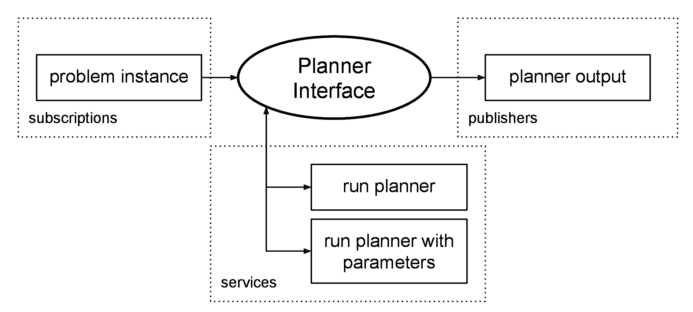

{: .big_chart }

The Planner Interface node is a wrapper for the AI Planner. The planner is called through a service, which returns true if a solution was found. This interface feeds the planner with a domain file and problem instance, and calls the planner with a command line specified by parameter. The problem instance can be supplied through subscription to a problem topic, or by file. The resulting solution, if one was found, can be written to a file and/or published on a ROS topic.

### Contents:

- Launch
- Services
- Publishers

### Launching a Planner Interface

There are implementations of the Planner Interface node used with the planners:

|**Node Type**         |**Compatible Planners**   |**Website**                              |
|popf_planner_interface|POPF                  |nms.kcl.ac.uk/planning/software/popf|
|                      |OPTIC                            |nms.kcl.ac.uk/planning/software/optic    |
|ff_planner_interface  |FF, Metric-FF, Contingent-FF|fai.cs.uni-saarland.de/hoffmann/ff       |
|lpg_planner_interface |LPG                       |lpg.unibs.it/lpg                         |
|tfd_planner_interface |TFD                       |gki.informatik.uni-freiburg.de/tools/tfd |
|smt_planner_interface |SMTPlan                   |kcl-planning.github.io/SMTPlan           |

An example launch file showing all the parameters is shown below:

```xml
<launch>

	<!-- arguments -->
	<arg name="node_name"            default="rosplan_planner_interface" />
	<arg name="use_problem_topic"    default="true" />
	<arg name="problem_topic"        default="/rosplan_problem_interface/problem_instance" />
	<arg name="planner_topic"        default="planner_output" />
	<arg name="domain_path"          default="$(find rosplan_demos)/common/domain_turtlebot_demo.pddl" />
	<arg name="problem_path"         default="$(find rosplan_demos)/common/problem.pddl" />
	<arg name="data_path"            default="$(find rosplan_demos)/common/" />
	<arg name="planner_command"      default="timeout 10 $(find rosplan_planning_system)/common/bin/popf DOMAIN PROBLEM" />


	<!-- planner interface -->
	<node name="$(arg node_name)" pkg="rosplan_planning_system" type="popf_planner_interface" respawn="false" output="screen">

		<!-- read problem from topic (instead of from file) -->
		<param name="use_problem_topic" value="$(arg use_problem_topic)" />

		<!-- ros topics -->
		<param name="problem_topic" value="$(arg problem_topic)" />
		<param name="planner_topic" value="$(arg planner_topic)" />

		<!-- directory for files -->
		<param name="domain_path" value="$(arg domain_path)" />
		<param name="problem_path" value="$(arg problem_path)" />
		<param name="data_path" value="$(arg data_path)" />

		<!-- to run the planner -->
		<!-- planner command replaces strings 'DOMAIN' and 'PROBLEM' with paths -->
		<param name="planner_command" value="$(arg planner_command)" />
	</node>

</launch>
```

## Services

Service: **planning_server**  
Type: *std_srvs/Empty*  
The service is intended to call a planner: 

- The command line in parameter *planner_command* will be run.
- The *domain_path* parameter will replace the string 'DOMAIN' in the command line.
- If *use_problem_topic* is true, then the last problem instance published on the problem topic will be passed to the planner, otherwise the problem will be read from *problem_path*.
- In either case, the problem path will replace the string 'PROBLEM' in the command line.
- The plan and any files generated by the planner will be written to *data_path*.
- The service returns when the command is finished, and returns true if a plan was found. The plan is published as a *std_msgs/string* on the planner topic.

Service: **planning_server_params**  
Type: *rosplan_dispatch_msgs/PlanningService*  
The planning_server is called, overriding the node parameters with the arguments of the service.

## Publishers

Topic: **planner_output**  
Type: *std_msgs/String*  
If a plan is found by the planner, it is published on this topic.
