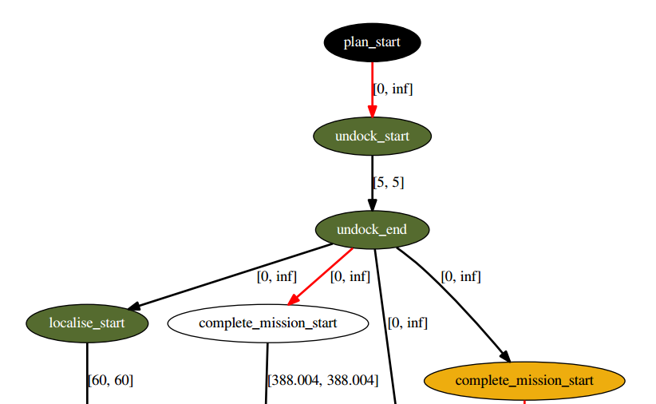

{: .big_chart }

The Parsing Interface node is used to convert planner output into a plan representation that can be executed, and whose actions can be dispatched to other parts of the system. Implementations of this node exist to represent plans as Petri-Net-Plans, ESTEREL plans, or sequential plans.

## Contents:

- Launch
- Services
- Publishers
- Plan Representations: Simple Plan
- Plan Representations: Esterel Plan

## Launching a Parsing Interface

There are two implementations of the Parsing Interface provided: *pddl_simple_plan_parser*, and *pddl_esterel_plan_parser*. These are described in more detail below.

An example launch file showing all the parameters is shown below:

```xml
<launch>

	<!-- arguments -->
	<arg name="node_name"        default="rosplan_parsing_interface" />
	<arg name="knowledge_base"   default="rosplan_knowledge_base" />
	<arg name="planner_topic"    default="/rosplan_planner_interface/planner_output" />
	<arg name="plan_topic"       default="complete_plan" />


	<!-- plan parsing -->
	<node name="$(arg node_name)" pkg="rosplan_planning_system" type="pddl_esterel_plan_parser" respawn="false" output="screen">
		<param name="knowledge_base" value="$(arg knowledge_base)" />
		<param name="planner_topic"  value="$(arg planner_topic)" />
		<param name="plan_topic"     value="$(arg plan_topic)" />
	</node>

</launch>
```

## Services

Topic: **parse_plan**  
Type: *std_srvs/Empty*  
Parses the last plan recieved on the *planner_topic*. The plan messages are published on the *plan_topic*.

Topic: **parse_plan_from_file**  
Type: *rosplan_dispatch_msgs/ParsingService*  
Parses a plan from file. The plan messages are published on the *plan_topic*.

|**Field**  |**Description**                                            |
|plan_path  |The path to the plan file. The plan must be in PDDL format.|
|plan_parsed|True if the plan was parsed succesfully.                   |

## Publishers

Topic: **plan_topic**  
Type: *varies**  
The plan is published on this topic in a form that can be executed by a *plan_dispatch* node.  
*The type of this message depends upon the implementation of the plan parser. Two implementations are described below.

## Plan Representations: Simple Plan

Type: *rosplan_dispatch_msgs/CompletePlan*  
The *CompletePlan* message stores an array of *rosplan_dispatch_msgs/ActionDispatch* messages. The array holds the action messages in the order in which they appear in the plan. This plan representation is sufficient for sequential dispatch, or temporal plans in which actions execute upon the completion of the previous action. For plans with concurrent execution, additional reasoning will be required by the executor in order to determine when actions should dispatch. In such cases, it is recommended to use the Esterel plan instead.

## Plan Representations: Esterel Plan

Type: *rosplan_dispatch_msgs/EsterelPlan*  
The *EsterelPlan* message stores a graph of *rosplan_dispatch_msgs/ActionDispatch* messages.


```xml
rosplan_dispatch_msgs/EsterelPlanNode[] nodes
byte ACTION_START=0
byte ACTION_END=1
byte PLAN_START=2
byte node_type
int32 node_id
string name
rosplan_dispatch_msgs/ActionDispatch action
int32[] edges_out
int32[] edges_in
rosplan_dispatch_msgs/EsterelPlanEdge[] edges
int32 edge_id
string edge_name
int32 signal_type
int32[] source_ids
int32[] sink_ids
float64 duration_lower_bound
float64 duration_upper_bound
```

Each node represents either a plan start, action start, or action end. Nodes are either waiting, executing, or complete. An action start node completes once the action is dispatched, while a action end node completes when the execution of the action returns. Edges represent causal or temporal orderings in the plan; an action start node can only be processed once all the nodes ordered previously are completed. The graph can be viewed as a DOT graph during execution.

{: .big_chart }
