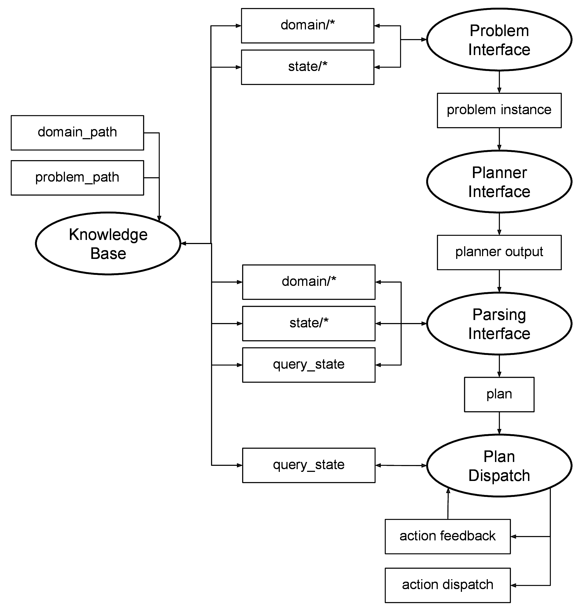
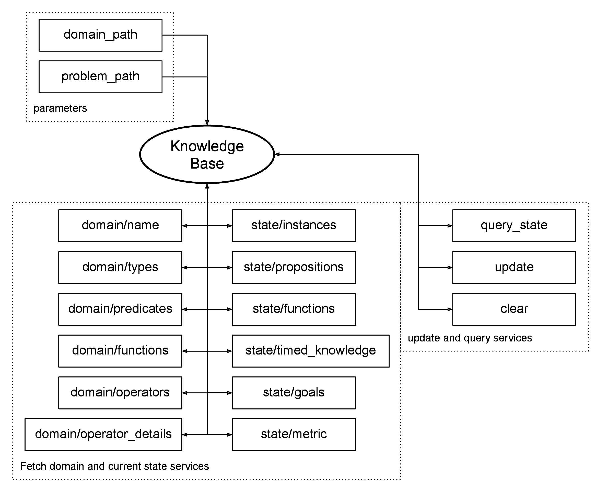
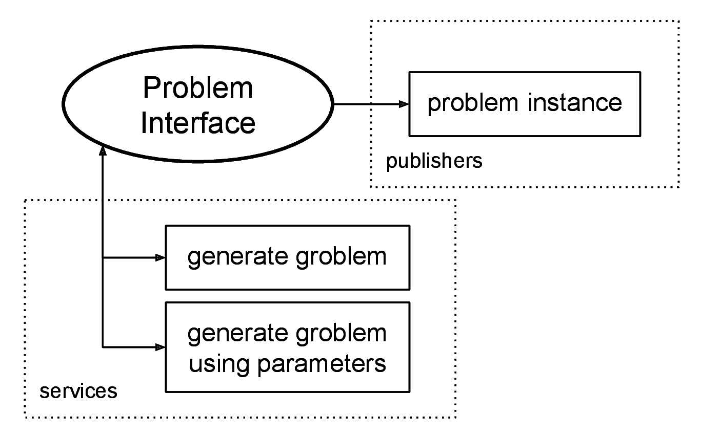
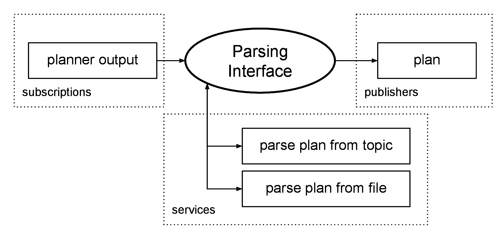
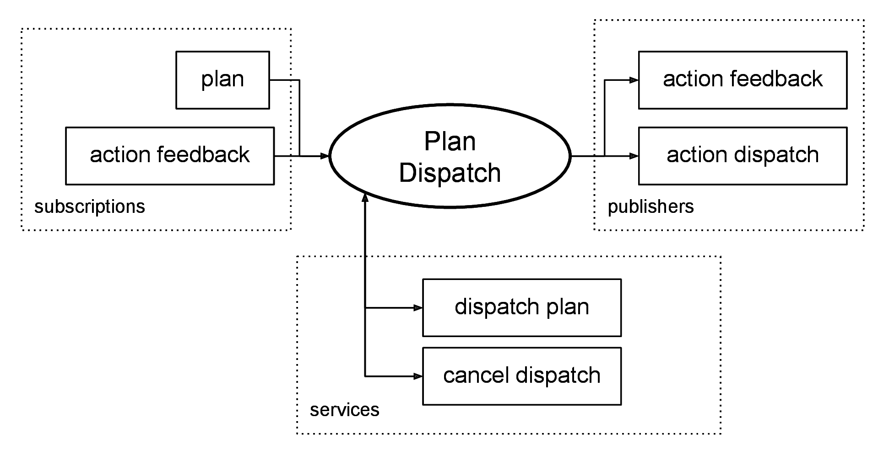

The ROSPlan framework provides a collection of tools for AI Planning in a ROS system. ROSPlan has a variety of nodes which encapsulate planning, problem generation, and plan execution.

{: .big_chart }

- The **Knowledge Base** is used to store a PDDL model.
- The **Problem Interface** is used to generate a PDDL problem, publish it on a topic, or write it to file.
- The **Planner Interface** is used to call a planner and publish the plan to a topic, or write it to file.
- The **Parsing Interface** is used to convert a PDDL plan into ROS messages, ready to be executed.
- The **Plan Dispatch** encapsulates plan execution.

## Knowledge Base

{: .big_chart }

The Knowledge Base stores the PDDL model. It stores both a domain model and the current problem instance. The Knowledge Base:

- Loads a PDDL domain (and optionally problem) from file.
- Stores the state as a PDDL instance.
- Is updated by ROS messages.
- Can be queried.

## Problem Interface

{: .big_chart }

The Problem Interface node is used to generate a problem instance. It fetches the domain details and current state through service calls to a Knowledge Base node and publishes a PDDL problem instance as a string, or writes it to file.

## Planner Interface

{: .big_chart }

The Planner Interface node is a wrapper for the AI Planner. The planner is called through a service, which returns true if a solution was found. This interface feeds the planner with a domain file and problem instance, and calls the planner with a command line specified by parameter.

## Parsing Interface

{: .big_chart }

The Parsing Interface node is used to convert planner output into a plan representation that can be executed, and whose actions can be dispatched to other parts of the system.

## Plan Dispatch

{: .big_chart }

Plan Dispatch includes plan execution, and the process of connecting single actions to the processes which are responsible for their execution. An implementation of the Plan Dispatch node subscribes to a plan topic, and is closely tied to the plan representation of plans published on that topic.
