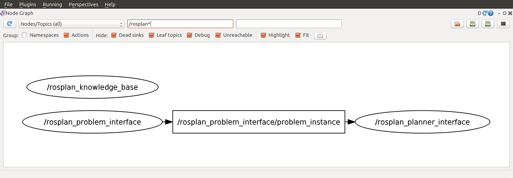

## 1. Description

This tutorial will teach how to use ROSPlan to call a planner and produce plans.


## 2. Prior Setup

This tutorial assumes that ROSPlan is already installed, following the instructions on the gihtub README:
[https://github.com/KCL-Planning/ROSPlan](https://github.com/KCL-Planning/ROSPlan).

Also that you have already followed [Tutorial 01: Problem Generation](tutorial_01), as this tutorial will extend the launch file created there.

## 3.1 Launching the Planner Interface

Change directory to the  ROSPlan workspace.

Copy the launch file *tutorial_01.launch* from the previous tutorial to create *tutorial_02.launch*, and then paste the following lines:

```xml
	<!-- planner interface -->
	<include file="$(find rosplan_planning_system)/launch/includes/planner_interface.launch">
		<arg name="use_problem_topic"    value="true" />
		<arg name="problem_topic"        value="/rosplan_problem_interface/problem_instance" />
		<arg name="planner_topic"        value="planner_output" />
		<arg name="domain_path"          value="$(arg domain_path)" />
		<arg name="problem_path"         value="$(find rosplan_demos)/common/problem.pddl" />
		<arg name="data_path"            value="$(find rosplan_demos)/common/" />
		<arg name="planner_command"      value="timeout 10 $(find rosplan_planning_system)/common/bin/popf DOMAIN PROBLEM" />
	</include>
```

The **Planner Interface** node, once launched, will provide a service that will call a PDDL planner and then publish the plan that it generates on a new topic. 

The node is launched from the included launch file. In that file you can see the type of node which is launched (`popf_planner_interface`)

```xml
	<node name="$(arg node_name)" pkg="rosplan_planning_system" type="popf_planner_interface" respawn="false" output="screen">
```

There are a number of possible node types that can be launched as a Planner Interface, depending upon the planner that you wich to use:

- `fd_planner_interface`
- `ff_planner_interface`
- `lpg_planner_interface`
- `metricff_planner_interface`
- `popf_planner_interface`
- `smt_planner_interface`
- `tfd_planner_interface`

## 3.2 The Launch File Explained

```xml
		<arg name="use_problem_topic"    value="true" />
		<arg name="problem_topic"        value="/rosplan_problem_interface/problem_instance" />
```

The `use_problem_topic` parameter, set true, means that the problem passed to the planner will be the one last published on the problem topic. This links our Planer Interface to a specific Problem Interface node.

```xml
		<arg name="planner_command"      value="timeout 10 $(find rosplan_planning_system)/common/bin/popf DOMAIN PROBLEM" />
```

The planner command is the command line that will be executed to call the planner. It contains two special strings, **DOMAIN** and **PROBLEM** that will be replaced with the domain and problem paths respectively.

## 3.3 Launching

From the terminal, launch the file:

```
roslaunch tutorial_02.launch
```

You should see that the Planner Interface has started:

```
KCL: (/rosplan_planner_interface) Ready to receive
```

To view the nodes, open a second terminal and launch **rqt**, and select the *Introspection -> Node Graph* plugin:

 

## 3.3 Calling the Planner

In the second terminal, first call the problem generation service (using tab complete is helpful), and then call the planning service:

```
rosservice call /rosplan_problem_interface/problem_generation_server
```

There will be no output in the second terminal, but in the first terminal you should see the following lines:

```
KCL: (/rosplan_problem_interface) (problem.pddl) Generating problem file.
KCL: (/rosplan_problem_interface) (problem.pddl) The problem was generated.
KCL: (/rosplan_planner_interface) Problem recieved.
```

This means that the Planner Interface is correctly subscribed to the problem topic of the Problem Interface. It has received the problem, which you can display using `rostopic echo`.

Now, call the planing service to generate a plan:

```
rosservice call /rosplan_planner_interface/planning_server
```

Again, there will be no output in the second terminal, but in the first terminal you will see the output produced by the Planner Interface:

```
KCL: (/rosplan_planner_interface) (problem.pddl) Writing problem to file.
KCL: (/rosplan_planner_interface) (problem.pddl) Running: timeout 10 ./src/rosplan/rosplan_planning_system/common/bin/popf [...]/domain_turtlebot.pddl [...]/problem.pddl > [...]/plan.pddl
KCL: (/rosplan_planner_interface) (problem.pddl) Planning complete
KCL: (/rosplan_planner_interface) (problem.pddl) Plan was solved.
```

The plan has been written to a file *plan.pddl*, the path to which you can see in the output. You can also view the plan by echoing the topic:

```
rostopic echo /rosplan_planner_interface/planner_output 
```

The Planner Interface publishes a plan like this:

```
 0.000: (undock kenny wp1)  [10.000]
10.001: (localise kenny)  [60.000]
70.002: (goto_waypoint kenny wp0 wp0)  [60.000]
130.003: (goto_waypoint kenny wp0 wp1)  [60.000]
190.004: (goto_waypoint kenny wp1 wp2)  [60.000]
250.005: (goto_waypoint kenny wp2 wp3)  [60.000]
310.006: (goto_waypoint kenny wp3 wp4)  [60.000]
```

## 3.4 Writing a Script to call both Services

Rather than calling each service by hand, we'll create a simple script to use ROSPlan to generate a problem and then a plan.

Create a new file called *tutorial.bash* and paste the following lines inside:

```
rosservice call /rosplan_problem_interface/problem_generation_server
rosservice call /rosplan_planner_interface/planning_server
```

Give permission for the script to be executed and run it with the following commands:

```
chmod 755 tutorial.bash
./tutorial.bash
```

For information on how to call ROS services from code, take a look at the tutorials for [c++](http://wiki.ros.org/ROS/Tutorials/WritingServiceClient) and [python](http://wiki.ros.org/ROS/Tutorials/WritingServiceClient%28python%29).

## 4. What's Next?

Simple Plan Execution in the next tutorial: [Tutorial 03: Plan Execution](tutorial_03)
