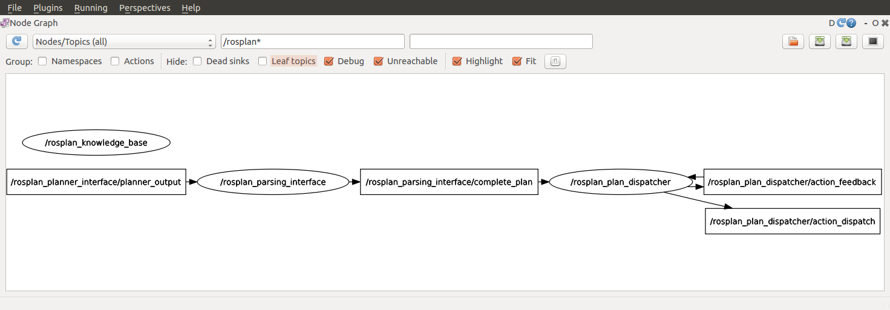

## 1. Description

This tutorial will teach how to use ROSPlan to read a plan from file and prepare it for execution.


## 2. Prior Setup

This tutorial assumes that ROSPlan is already installed, following the instructions on the gihtub README:
[https://github.com/KCL-Planning/ROSPlan](https://github.com/KCL-Planning/ROSPlan).

## 3.1 Launch File

Change directory to the  ROSPlan workspace.

Create a new launch file, *tutorial_03.launch*, in the current directory and paste the following inside it:

```xml
<?xml version="1.0"?>
<launch>

	<!-- arguments -->
	<arg name="domain_path"	default="$(find rosplan_demos)/common/domain_turtlebot.pddl" />
	<arg name="problem_path"	default="$(find rosplan_demos)/common/problem_turtlebot.pddl" />

	<!-- knowledge base -->
	<node name="rosplan_knowledge_base" pkg="rosplan_knowledge_base" type="knowledgeBase" respawn="false" output="screen">
		<param name="domain_path" value="$(arg domain_path)" />
		<param name="problem_path" value="$(arg problem_path)" />
		<param name="database_path" value="$(find rosplan_knowledge_base)/common/mongoDB/" />
		<!-- conditional planning flags -->
		<param name="use_unknowns" value="false" />
	</node>
	
	<!-- scene database (MongoDB) -->
	<include file="$(find mongodb_store)/launch/mongodb_store.launch">
		<arg name="db_path" value="$(find rosplan_knowledge_base)/common/mongoDB/"/>
	</include>

	<!-- plan parsing -->
	<node name="rosplan_parsing_interface" pkg="rosplan_planning_system" type="pddl_simple_plan_parser" respawn="false" output="screen">
		<param name="knowledge_base" value="rosplan_knowledge_base" />
		<param name="planner_topic"  value="/rosplan_planner_interface/planner_output" />
		<param name="plan_topic"     value="complete_plan" />
	</node>

	<!-- plan dispatching -->
	<node name="rosplan_plan_dispatcher" pkg="rosplan_planning_system" type="pddl_simple_plan_dispatcher" respawn="false" output="screen">
		<param name="knowledge_base"        value="rosplan_knowledge_base" />
		<param name="plan_topic"            value="/rosplan_parsing_interface/complete_plan" />
		<param name="action_dispatch_topic" value="action_dispatch" />
		<param name="action_feedback_topic" value="action_feedback" />
	</node>

</launch>
```

## 3.2 The Launch File Explained

The first ROSPlan node is the **Knowledge Base**. This node stores the PDDL model: both the domain and the current state.

The Knowledge Base node takes 4 parameters which are explained in [Tutorial 01: Problem Generation](../01_problem_generation/turorial_01.mk) and in the documentation.

```xml
	<!-- plan parsing -->
	<node name="rosplan_parsing_interface" pkg="rosplan_planning_system" type="pddl_simple_plan_parser" respawn="false" output="screen">
		<param name="knowledge_base" value="rosplan_knowledge_base" />
		<param name="planner_topic"  value="/rosplan_planner_interface/planner_output" />
		<param name="plan_topic"     value="complete_plan" />
	</node>
```

The second node is the **Parsing Interface**. This node subscribes to a string topic and waits for a plan to be published. It takes 3 parameters:

1. `knowledge_base` specifies which Knolwedge Base node stores the domain and state to be used with the plan.
2. `planner_topic` specifies the input topic on which the plan will be published as a string.
3. `plan_topic` specifies the output topic on which the plan messages will be published.

In this tutorial we are using the **pddl_simple_plan_parser**. This plan parser will represent the plan as an ordered list of action messages.

```xml
	<!-- plan dispatching -->
	<node name="rosplan_plan_dispatcher" pkg="rosplan_planning_system" type="pddl_simple_plan_dispatcher" respawn="false" output="screen">
		<param name="knowledge_base"        value="rosplan_knowledge_base" />
		<param name="plan_topic"            value="/rosplan_parsing_interface/complete_plan" />
		<param name="action_dispatch_topic" value="action_dispatch" />
		<param name="action_feedback_topic" value="action_feedback" />
	</node>
```

The third node is the **Plan Dispatch**. This node implements a plan execution algorithm.

1. `knowledge_base` specifies which Knolwedge Base node stores the domain and state to be used with the plan.
2. `plan_topic` specifies the input topic on which the plan will be published as a set of action messages.
3. `action_dispatch_topic` specifies the topic on which the action messages will be published.
3. `action_feedback_topic` specifies the topic on the failure or completion of actions will be published.

In this tutorial, since we are using the pddl_simple_plan_parser, we will use the **pddl_simple_plan_dispatcher**. This dispatcher uses a very simple algorithm for plan execution, which expects input plans to be an ordered list of action messages.

## 3.3 Launching

From the terminal, launch the file:

```
roslaunch tutorial_03.launch
```

You should see that all of the nodes have started:

```
KCL: (/rosplan_parsing_interface) Ready to receive
KCL: (/rosplan_plan_dispatcher) Ready to receive
KCL: (KB) Ready to receive
```

To view the nodes, open a second terminal and launch **rqt**, and select the *Introspection -> Node Graph* plugin:

 

## 3.4 Parsing a Plan from File

Create a new file in the current directory, *plan_tutorial_03.pddl* and paste in the following lines:

```
 0.000: (undock kenny wp1)  [10.000]
10.001: (localise kenny)  [60.000]
70.002: (goto_waypoint kenny wp0 wp0)  [60.000]
130.003: (goto_waypoint kenny wp0 wp1)  [60.000]
190.004: (goto_waypoint kenny wp1 wp2)  [60.000]
250.005: (goto_waypoint kenny wp2 wp3)  [60.000]
310.006: (goto_waypoint kenny wp3 wp4)  [60.000]
```

We'll parse this plan using ROSPlan into ROS messages, ready for execution.

In the second terminal, first call the plan parsing service (using tab complete is helpful), substituting the absolute path to your workspace:

```
rosservice call /rosplan_parsing_interface/parse_plan_from_file "plan_path: '[...]/plan_tutorial_03.pddl'"
```

There will be no output in the second terminal, but in the first terminal you should see the following lines:

```
KCL: (/rosplan_parsing_interface) Parsing plan from file.
KCL: (/rosplan_plan_dispatcher) Plan received.
```

This means that the Plan Dispatch is correctly subscribed to the Plan of the Problem Interface.

Now, let's see what the plan looks like on this topic:

```
rostopic echo /rosplan_parsing_interface/complete_plan -n 1
```

You will see a lot of output. This is the ROS message representation of the plan. It should start like this:

```
plan: 
  - 
    action_id: 0
    name: undock
    parameters: 
      - 
        key: v
        value: kenny
      - 
        key: wp
        value: wp1
    duration: 10.0
    dispatch_time: 0.0
  - 
    action_id: 1
    name: localise
    parameters: 
      - 
        key: v
        value: kenny
    duration: 60.0
    dispatch_time: 10.0010004044
```

Here you can see the first two action, *undock* and *localise* and their parameters.

The structure of a `CompletePlan` message can be seen using the following command:

```
rosmsg show rosplan_dispatch_msgs/CompletePlan
```

Shown here:

```
rosplan_dispatch_msgs/ActionDispatch[] plan
  int32 action_id
  string name
  diagnostic_msgs/KeyValue[] parameters
    string key
    string value
  float32 duration
  float32 dispatch_time
```

## 4. What's Next?

Now the plan is ready to execute -- but nothing will happen as there is no lower-level control to handle the execution of any PDDL actions. In the next tutorial, [Tutorial 04: Simulated Actions](tutorial_04) we will look at **simulated actions** which will allow us to simulate the execution of the plan.

In [Tutorial 05: Plan execution II](tutorial_05) we look at another kind of Parsing Interface and Plan Dispatch, able to represent temporal plans with concurrency.

In [Tutorial 10: Action Interface](tutorial_10) we describe how to write a real action interface, to replace the simulated actions, and connect the PDDL action with the real lower-level control.
