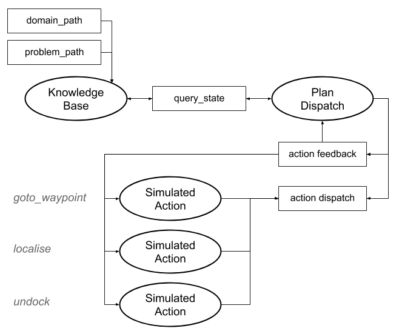
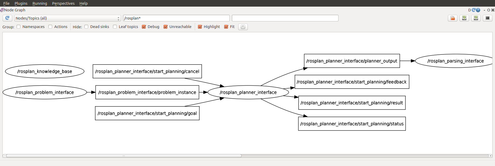
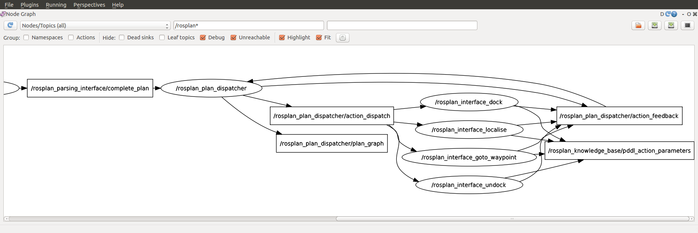

## 1. Description

This tutorial will teach how to set up simulated action components to execute PDDL actions.

## 2. Prior Setup

This tutorial assumes that you have have already followed [Tutorial 02: Planning](tutorial_02) and [Tutorial 03: Plan Execution I](tutorial_03).

## 3.1 Launch File

Change directory to the  ROSPlan workspace.

Create a new launch file, *tutorial_04.launch*, and paste the following code:

```xml
<?xml version="1.0"?>
<launch>

	<!-- ROSPlan -->
	<include file="$(find rosplan_planning_system)/launch/interfaced_planning_system.launch" >
		<arg name="domain_path"		value="$(find rosplan_demos)/common/domain_turtlebot.pddl" />
		<arg name="problem_path"	value="$(find rosplan_demos)/common/problem_turtlebot.pddl" />
	</include>

	<!-- sim actions -->
	<include file="$(find rosplan_planning_system)/launch/includes/simulated_action.launch" >
		<arg name="pddl_action_name" value="undock" />
	</include>
	<include file="$(find rosplan_planning_system)/launch/includes/simulated_action.launch" >
		<arg name="pddl_action_name" value="dock" />
	</include>
	<include file="$(find rosplan_planning_system)/launch/includes/simulated_action.launch" >
		<arg name="pddl_action_name" value="localise" />
	</include>
	<include file="$(find rosplan_planning_system)/launch/includes/simulated_action.launch" >
		<arg name="pddl_action_name" value="goto_waypoint" />
	</include>
</launch>
```

## 3.2 The Launch File Explained

The Launch file is in two sections. The first includes *interfaced_planning_system.launch*, the second includes the simulated actions.

Take a look at *interfaced_planning_system.launch* in the *rosplan_planning_system* package. This launch file includes all of the parameters for each ROSPlan node, and sets up the configuraton shown in the diagram below.

```xml
	<include file="$(find rosplan_planning_system)/launch/includes/simulated_action.launch" >
		<arg name="pddl_action_name" value="undock" />
	</include>
```


The next part is the simulated actions. Each simulated action includes the *simulated_action.launch* file shown below:

```xml
<?xml version="1.0"?>
<launch>

	<!-- arguments -->
	<arg name="pddl_action_name" />
	<arg name="action_duration"		default="0.0" />
	<arg name="action_probability"	default="1.0" />
	<arg name="knowledge_base"		default="rosplan_knowledge_base" />
	<arg name="action_dispatch_topic"	default="/rosplan_plan_dispatcher/action_dispatch" />
	<arg name="action_feedback_topic"	default="/rosplan_plan_dispatcher/action_feedback" />

	<!-- simulated action -->
	<node name="rosplan_interface_$(arg pddl_action_name)" pkg="rosplan_planning_system" type="simulatedAction" respawn="false" output="screen">
		<param name="knowledge_base"		value="$(arg knowledge_base)" />
		<param name="pddl_action_name"		value="$(arg pddl_action_name)" />
		<param name="action_duration"		value="$(arg action_duration)" />
		<param name="action_probability"	value="$(arg action_probability)" />
		<param name="action_dispatch_topic" value="$(arg action_dispatch_topic)" />
		<param name="action_feedback_topic" value="$(arg action_feedback_topic)" />
	</node>

</launch>
```

This launch file launches a node of type **simulatedAction**. In our launch file we set the *pddl_action_name* argument, and use the default value for all of the others. This means each action will have a duration of 0 seconds, and always succeed. The action names match those in the domain file, *domain_turtlebot.pddl*.

The simulated actions will be added to the configuration as shown in the diagram below:



## 3.3 Launching

From the terminal, launch the file:

```
roslaunch tutorial_04.launch
```

You should see the output from each of the simulated actions, like this:

```
[ INFO] [1528191989.363215382]: KCL: (localise) Ready to receive
[ INFO] [1528191989.410538907]: KCL: (dock) Ready to receive
[ INFO] [1528191989.414754601]: KCL: (undock) Ready to receive
[ INFO] [1528191989.417351283]: KCL: (goto_waypoint) Ready to receive
```

Open a second terminal, run **rqt**, and select the *Introspection -> Node Graph* plugin. You should see the same nodes and topics as in the screenshots here:





The simulated action nodes are publishing on a topic `rosplan_knowledge_base/pddl_action_parameters`. Close rqt and let's look at the contents of three of those messages using `rostopic echo`:

```
rostopic echo /rosplan_knowledge_base/pddl_action_parameters -n 3
```

This topic is publishing the parameter labels and types of the PDDL operator:

```
name: goto_waypoint
typed_parameters: 
  - 
    key: v
    value: robot
  - 
    key: from
    value: waypoint
  - 
    key: to
    value: waypoint
```

## 3.4 Updating and Running the Script

Rather than calling each service by hand, we'll create a simple script to use ROSPlan to generate a problem and then a plan.

Create or open the file called *tutorial.bash*, delete everything inside, and paste the following lines instead:

```
echo "Generating a Problem"
rosservice call /rosplan_problem_interface/problem_generation_server

echo "Planning"
rosservice call /rosplan_planner_interface/planning_server

echo "Executing the Plan"
rosservice call /rosplan_parsing_interface/parse_plan
rosservice call /rosplan_plan_dispatcher/dispatch_plan
```

Make sure the script has permission to be executed, then run it:

```
chmod 755 tutorial.bash
./tutorial.bash
```

For information on how to call ROS services from code, take a look at the tutorials for [c++](http://wiki.ros.org/ROS/Tutorials/WritingServiceClient) and [python](http://wiki.ros.org/ROS/Tutorials/WritingServiceClient%28python%29).

Take a look at the output in the first terminal, where *tutorial_04.launch* was launched. You will see the output from the previous tutorials, showing that the problem has been generated, a plan generated, and dispatch started. In addition you will see the ouput from the execution of the plan. Here we show just the first action:

```
KCL: (/rosplan_plan_dispatcher) Dispatching plan.
KCL: (/rosplan_plan_dispatcher) Dispatching action [0, undock, 3.099019, 10.000000]
KCL: (undock) action recieved
KCL: (KB) Removing domain attribute (docked)
KCL: (undock) Action completing with probability 1.000000 and duration 0.000000
KCL: (KB) Adding fact (undocked kenny)
KCL: (/rosplan_plan_dispatcher) Feedback received [0, action enabled]
KCL: (/rosplan_plan_dispatcher) Feedback received [0, action achieved]
KCL: (/rosplan_plan_dispatcher) 0: action undock completed
...
```

Let's break the output of the first action down, line by line.

```
KCL: (/rosplan_plan_dispatcher) Dispatching plan.
KCL: (/rosplan_plan_dispatcher) Dispatching action [0, undock, 3.099019, 10.000000]
```

First the PDDL action message is published on the action dispatch topic.

```
KCL: (undock) action recieved
KCL: (KB) Removing domain attribute (docked)
```

Next the simulated action node prints that it has received a PDDL action with a matching name, in these lines the *undock* action. The start effect of the action is immediately applied. The **Knowledge Base** node prints that the proposition *docked* has become false.

```
KCL: (undock) Action completing with probability 1.000000 and duration 0.000000
KCL: (KB) Adding fact (undocked kenny)
```

The simulated action node prints that it is completing the action with certain probability and 0 duration, since this is what we specified in the node's parameters. The end effect of the action is appled in the Knolwedge Base, which lets us know that the *undocked* proposition has become true.

```
KCL: (/rosplan_plan_dispatcher) Feedback received [0, action enabled]
KCL: (/rosplan_plan_dispatcher) Feedback received [0, action achieved]
KCL: (/rosplan_plan_dispatcher) 0: action undock completed
```

Since the duration of the action was 0, the output from the dispatcher arrives all at once. The three lines correspond to:

1. The action enabled feedback has been published on the action feedback topic.
2. The action achieved feedback has been published on the action feedback topic.
3. The dispatcher has acknowledge the completion of the action.

You can see the contents of an action feedback message using `rostopic echo`:

```
rostopic echo /rosplan_plan_dispatcher/action_feedback -n 1
```

Which should show something like this:

```
action_id: 1
status: action achieved
information: []
```

The `action_id` matches that from the action dispatch message.

## 4. What's Next?

In the next tutorial, [Tutorial 05: Plan execution II](tutorial_05) we look at another kind of Parsing Interface and Plan Dispatch, able to represent temporal plans with concurrency. We will use simulated actions again, with non-zero duration.

In [Tutorial 10: Action Interface](tutorial_10) we describe how to write a real action interface, to replace the simulated actions, and connect the PDDL action with the real lower-level control.
