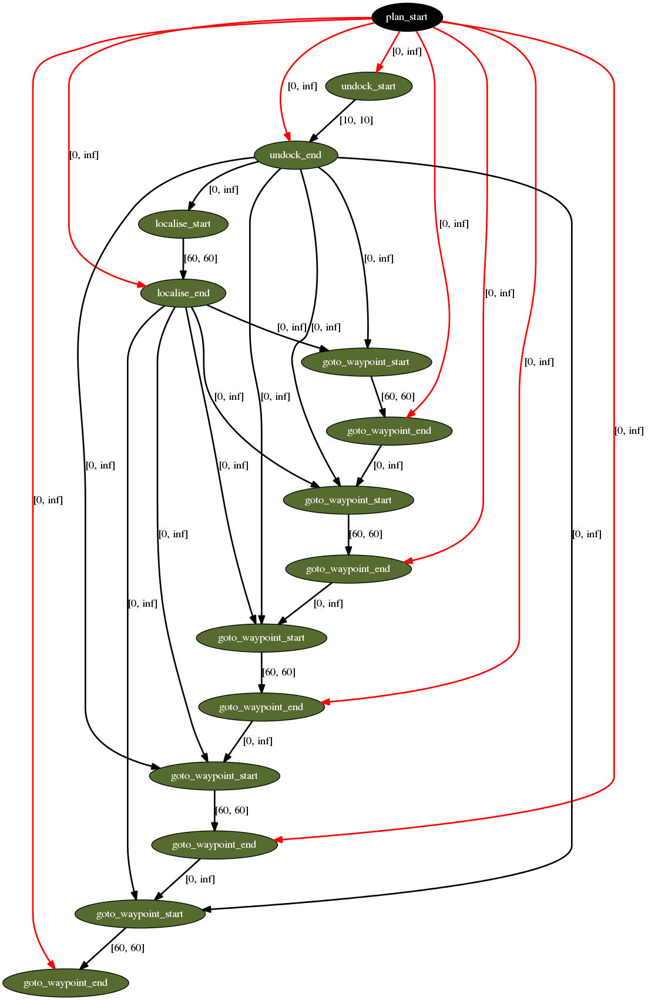

## 1. Description

This tutorial will describe the Esterel Plan representation and show how to view the plan currently under execution.

## 2. Prior Setup

This tutorial assumes that you have have already followed [Tutorial 04: Planning](tutorial_04), and will use the same launch files and scripts.

## 3.1 Launch File

Change directory to the  ROSPlan workspace.

Copy the launch file from Tutorial 04 as *tutorial_05.launch*, and add the `action_duration` parameter to each of the simulated actions so that the simulated actions look like the following:

```xml
	<!-- sim actions -->
	<include file="$(find rosplan_planning_system)/launch/includes/simulated_action.launch" >
		<arg name="pddl_action_name" value="undock" />
		<arg name="action_duration" value="5" />
	</include>
	<include file="$(find rosplan_planning_system)/launch/includes/simulated_action.launch" >
		<arg name="pddl_action_name" value="dock" />
		<arg name="action_duration" value="15" />
	</include>
	<include file="$(find rosplan_planning_system)/launch/includes/simulated_action.launch" >
		<arg name="pddl_action_name" value="localise" />
		<arg name="action_duration" value="60" />
	</include>
	<include file="$(find rosplan_planning_system)/launch/includes/simulated_action.launch" >
		<arg name="pddl_action_name" value="goto_waypoint" />
		<arg name="action_duration" value="45" />
	</include>
```

Then take another look at the *interface_planning_system.launch* in the *rosplan_planning_system* package.

```xml
	<!-- plan parsing -->
	<include file="$(find rosplan_planning_system)/launch/includes/parsing_interface.launch">
		<arg name="knowledge_base"   value="rosplan_knowledge_base" />
		<arg name="planner_topic"    value="/rosplan_planner_interface/planner_output" />
		<arg name="plan_topic"       value="complete_plan" />
	</include>

	<!-- plan dispatch -->
	<include file="$(find rosplan_planning_system)/launch/includes/dispatch_interface.launch">
		<arg name="knowledge_base"           value="rosplan_knowledge_base" />
		<arg name="plan_topic"               value="/rosplan_parsing_interface/complete_plan" />
		<arg name="action_dispatch_topic"    value="action_dispatch" />
		<arg name="action_feedback_topic"    value="action_feedback" />
	</include>
```

The **Parsing Interface** and **Plan Dispatch** nodes are launched from the included files. These do not launch the Simple PDDL variants used in [Tutorial 03: Plan Execution I](../03_plan_parsing/tutorial_03.mk). Instead, they launch nodes of type: *pddl_esterel_plan_parser* and *pddl_esterel_plan_dispatcher*.

## 3.2 Launching

From the terminal, launch the file:

```
roslaunch tutorial_05.launch
```

Switch to a second terminal and source the workspace. Using the script written for [Tutorial 04: Simulated Actions](../04_simulated_actions/tutorial_04.mk), start problem generation, planning, and plan dispatch.

```
./tutorial.bash
```

This time, the plan will be dispatching more slowly, since the actions take some time to complete.

## 3.3 Viewing the Esterel Plan

Open a third terminal, and source the workspace. From this terminal, take a look at the information for the dispatcher node:

```
rosnode info /rosplan_plan_dispatcher
```

Have a look at the publishers and subscribers for this node. Note that the message type for the *complete_plan* topic is different from teh simple plan. use `rosmsg show rosplan_dispatch_msgs/EsterelPlan` to see the structure of the new plan message:

```
rosplan_dispatch_msgs/EsterelPlanNode[] nodes
  byte ACTION_START=0
  byte ACTION_END=1
  byte PLAN_START=2
  byte node_type
  int32 node_id
  string name
  rosplan_dispatch_msgs/ActionDispatch action
    int32 action_id
    string name
    diagnostic_msgs/KeyValue[] parameters
      string key
      string value
    float32 duration
    float32 dispatch_time
  int32[] edges_out
  int32[] edges_in
rosplan_dispatch_msgs/EsterelPlanEdge[] edges
  int32 edge_id
  string edge_name
  int32 signal_type
  int32[] source_ids
  int32[] sink_ids
  float64 duration_lower_bound
  float64 duration_upper_bound
```

This plan representation is an array of nodes, which can be of type: plan start, action start, or action end; and an array of edges between nodes, each associated with upper and lower temporal bounds.

Use this command,

```
rostopic echo /rosplan_parsing_interface/complete_plan -n 1
```

to show the plan message that was passed to the dispatcher:

```
  - 
    node_type: 2
    node_id: 0
    name: plan_start
    action: 
      action_id: 0
      name: ''
      parameters: []
      duration: 0.0
      dispatch_time: 0.0
    edges_out: [0, 2, 5, 9, 14, 19, 24, 29]
    edges_in: []
  - 
    node_type: 0
    node_id: 1
    name: undock_start
    action: 
      action_id: 0
      name: undock
      parameters: 
        - 
          key: v
          value: kenny
        - 
          key: wp
          value: wp0
      duration: 10.0
      dispatch_time: 0.0
    edges_out: [1]
    edges_in: [0]
```
The plan begins with a node representing the plan start. The next node corresponds to the start of the first action in the plan, *(undock kenny wp0)*.

There is a lot of text describing the plan, and it is not easy to see the structure. Instead, there is a graphical representation. Using `rosnode info` again, notice that the *pddl_esterel_plan_dispatcher* is publishing on a topic */rosplan_plan_dispatcher/plan_graph*. Use `rostopic echo` to view the contents of this topic:

```
rostopic echo /rosplan_plan_dispatcher/plan_graph -n 1
```

The contents of the message is a DOT graph, visualising the plan.

```
digraph plan {
0[ label="plan_start",style=filled,fillcolor=black,fontcolor=white];
1[ label="undock_start",style=filled,fillcolor=darkolivegreen,fontcolor=white];
2[ label="undock_end",style=filled,fillcolor=darkolivegreen,fontcolor=white];
3[ label="localise_start",style=filled,fillcolor=darkolivegreen,fontcolor=white];
4[ label="localise_end",style=filled,fillcolor=darkolivegreen,fontcolor=white];
5[ label="goto_waypoint_start",style=filled,fillcolor=darkolivegreen,fontcolor=white];
6[ label="goto_waypoint_end",style=filled,fillcolor=darkolivegreen,fontcolor=white];
7[ label="goto_waypoint_start",style=filled,fillcolor=darkolivegreen,fontcolor=white];
8[ label="goto_waypoint_end",style=filled,fillcolor=darkolivegreen,fontcolor=white];
9[ label="goto_waypoint_start",style=filled,fillcolor=darkolivegreen,fontcolor=white];
10[ label="goto_waypoint_end",style=filled,fillcolor=darkolivegreen,fontcolor=white];
11[ label="goto_waypoint_start",style=filled,fillcolor=darkolivegreen,fontcolor=white];
12[ label="goto_waypoint_end",style=filled,fillcolor=darkolivegreen,fontcolor=white];
13[ label="goto_waypoint_start",style=filled,fillcolor=darkolivegreen,fontcolor=white];
14[ label="goto_waypoint_end",style=filled,fillcolor=darkolivegreen,fontcolor=white];
"0" -> "1" [ label="[0, inf]" , penwidth=2 , color="red"]
"1" -> "2" [ label="[10, 10]" , penwidth=2 , color="black"]
"0" -> "2" [ label="[0, inf]" , penwidth=2 , color="red"]
"2" -> "3" [ label="[0, inf]" , penwidth=2 , color="black"]
"3" -> "4" [ label="[60, 60]" , penwidth=2 , color="black"]
"0" -> "4" [ label="[0, inf]" , penwidth=2 , color="red"]
"4" -> "5" [ label="[0, inf]" , penwidth=2 , color="black"]
"2" -> "5" [ label="[0, inf]" , penwidth=2 , color="black"]
"5" -> "6" [ label="[60, 60]" , penwidth=2 , color="black"]
"0" -> "6" [ label="[0, inf]" , penwidth=2 , color="red"]
"6" -> "7" [ label="[0, inf]" , penwidth=2 , color="black"]
"4" -> "7" [ label="[0, inf]" , penwidth=2 , color="black"]
"2" -> "7" [ label="[0, inf]" , penwidth=2 , color="black"]
"7" -> "8" [ label="[60, 60]" , penwidth=2 , color="black"]
"0" -> "8" [ label="[0, inf]" , penwidth=2 , color="red"]
"8" -> "9" [ label="[0, inf]" , penwidth=2 , color="black"]
"4" -> "9" [ label="[0, inf]" , penwidth=2 , color="black"]
"2" -> "9" [ label="[0, inf]" , penwidth=2 , color="black"]
"9" -> "10" [ label="[60, 60]" , penwidth=2 , color="black"]
"0" -> "10" [ label="[0, inf]" , penwidth=2 , color="red"]
"10" -> "11" [ label="[0, inf]" , penwidth=2 , color="black"]
"4" -> "11" [ label="[0, inf]" , penwidth=2 , color="black"]
"2" -> "11" [ label="[0, inf]" , penwidth=2 , color="black"]
"11" -> "12" [ label="[60, 60]" , penwidth=2 , color="black"]
"0" -> "12" [ label="[0, inf]" , penwidth=2 , color="red"]
"12" -> "13" [ label="[0, inf]" , penwidth=2 , color="black"]
"4" -> "13" [ label="[0, inf]" , penwidth=2 , color="black"]
"2" -> "13" [ label="[0, inf]" , penwidth=2 , color="black"]
"13" -> "14" [ label="[60, 60]" , penwidth=2 , color="black"]
"0" -> "14" [ label="[0, inf]" , penwidth=2 , color="red"]
}
```
Create a new file in the current directory, *plan.dot* and copy in the contents of the message. If you copy from the terminal, make sure to remove the "data:" prefix at the start of the message.

Use **dot** (install it if you do not have it) to convert the plan into a PDF:

```
dot -Tpdf plan.dot > plan.pdf
```

Open the PDF to view the plan. The node and edge colours change depending upon the state of execution.

{: .big_chart }

Edges represent temporal constraints, actions supporting preconditions, and mutual exclusion relations. Note that the nodes representing the ends of the *undock* and *localise* actions support all of the *goto_waypoint* action starts. This is because the *goto_waypoint* action has the condition:

```
	:condition (and
		(at start (localised ?v))
		(over all (undocked ?v))
		...
```

## 4. What's Next?

In the next tutorial, [Tutorial 06: Knowledge Base I](tutorial_06), we will explore the services provided by the ROSPlan **Knowledge Base** node.

In [Tutorial 10: Action Interface](tutorial_10) we describe how to write a real action interface, to replace the simulated actions, and connect the PDDL action with the real lower-level control.
