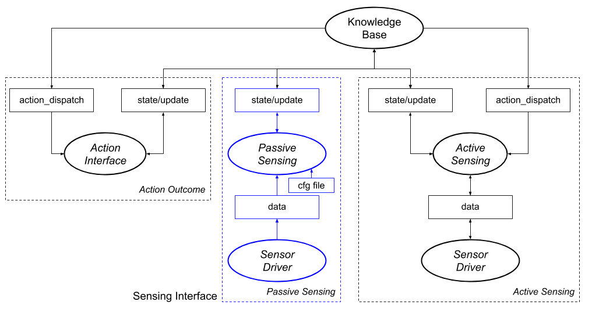

## 1.  Description

This tutorial will cover how to link ROSPlan with sensor data or any other related information that can be used to update the **Knowledge Base**.

When using ROSPlan with real robots, the actions may not always succeed, and the state of the world can change for reasons unrelated to the robot (as the real world tends to be more complex than the PDDL domain). 
Unexpected things may happen, so we need to update the KB accordingly, and doing manually tends to be tedious and repetitive.

Usually, the KB update process consists on:
   1.  Get sensor data or state of the world
   2. Compute predicate values from the sensory information
   3. Update the KB with the new predicate values
   4. Repeat

The ROSPlan's **Sensing Interface** allows to do so in a more automatic way, by just defining a simple config file.
It has the following features:

  1. Automatic subscription to ROS topics and periodic call to ROS services.
  2. Automatic update of the Knowledge Base when the predicates has changed.
  3. Simple Python-based YAML config file, also allowing for more powerful custom-method definitions.


The following diagram shows the available options for updating the Knowledge Base with sensory data. The three methods are by using the action interface and updating the state based on the action outcome, to subscribe (automatically) to topics that give information with the Sensing Interface, or to build an active sensing node that processes the actions and sensor data to compute the new state and updates it to the Knoweldge Base. The Sensing  Interface elements are highlighted in blue.
{:width="800px"}


### When should you use the Sensing Interface:
- When you have a topic that publishes data regularly and this data is used to update the Knowledge Base (usually after some processing).
- When you have a service that gets called regularly and whose response is used to update the Knowledge Base (usually after some processing).

 And it is clear how should this information be used to update the KB without any other input. 

### When should you use a custom approach to update the KB:
If the update of the Knowledge Base does not depend on a single topic/service, it needs extra information or does not have an easy processing to update the Knowledge Base is better that you update the Knowledge Base by some other means.

## 2. Prior information
This tutorial assumes you know how does ROSPlan and its Knowledge Base works. If you don't, please follow [Tutorial 06: Knowledge Base I](tutorial_06) and on.

We will be using the following files:
- Sensing config file: A YAML file that will define which topics are subscribed and how are they processed.
- Custom scripts file: A python file that will include custom methods to process the data. *(optional)*
- Rosplan sensing launchfile: Will load the configuration files and launch the rosplan_sensing_interface.


## 3. Setting up the Sensor Interface
Now we will define and explain how each file should be filled.

### Configuration file
The configuration file is a YAML file that defines how each predicate is updated.

It has 3 sections: functions, topics and services.
#### functions *(optional)*:
Defines where is the custom scripts file. 
It allows to use the macro `$(find pkg_name)` to avoid writting the whole package path.
The python file will be loaded automatically. 
Fore more information check [custom file](#custom-file).

Example:
```yaml
functions:
    - $(find rps_tutorial)/src/rps_tutorial.py
```

#### topics:
It defines the topics that are to be automatically subscribed and how do their messages update the Knowledge Base.
The format is the following:
```yaml
topics:
  PREDICATE_NAME:
    params:
        - P1
        - P2
    topic: /TOPIC
    msg_type: XXX_PKGS/MESSAGE
    operation: PYTHON_STRING
```
Where:
   - PREDICATE_NAME is the predicate of the Knowledge Base/domain that will be updated.
   - P1 and P2 are parameters of the predicate. There **must** be the same numbers of parameters as defined in the Knowledge Base or domain. They must be grounded parameters (i.e. real instances). A wildcard `'*'` is also allowed for the cases where the custom scripts are used.
   - topic: The topic to which it should be subscribed.
   - msg_type: The type of messages that are sent through the specified topic.
   - operation: a single line Python string that processes the message. The **`msg`** keyword is reserved and instantiated as the received message through the topic. Therefore, for a message of type `std_msgs/String`, you can acces the string by using `msg.data` in your python line. This line will be processed with the incoming message **for every message sent through the topic**. The result of the processing of this line **MUST BE** of the same type of the predicate (usually boolean).

Here there is an example of configuration file that updates a predicate names `robot_at` with parameters `kenny` and `wp0`.
```yaml
topics:
  robot_at:
    params:
        - kenny
        - wp0
    topic: /string_topic
    msg_type: std_msgs/String
    operation: "'wp0' in msg.data and msg.data.split(' ')[1] == 'yes'"
```
**How does it work?**
Imagine that we have a "sensor" that published message of type `std_msgs/String` through a topic called `/string_topic`. This topic publishes the robot position in the following format: `wpX yes/no`, where wpX is a waypoint.

Then, our configuration file will make the Sensing Interface automatically subscribe to the topic, and it will process the messgaes as defined in the operation line, where `msg.data` is the received string. Therefore, the line checks if wp0 is in the string, and whether the last string is equal to 'yes'.
The result of processing this line will be a booelan value that will be used to update the knowledge base. Therefore, if the message received is `wp0 yes`, the result will be True and the Knowledge Base will be updated with the fact `(robot_at kenny wp0) = true`. Otherwise it will set it to false.

The Sensing Interface keeps track of the previous result and will only update the KB on change of the predicate.


#### services:
It defines the services that are to be automatically called and how do their messages update the Knowledge Base.
The format is similar to the topics one, with some differences. It is the following:
```yaml
services:
  PREDICATE_NAME:
      params:
          - P1
      service: /test_service # Service
      srv_type: xxx_pkg/SERVICE_TYPE # Srv type
      time_between_calls: 1 # Time between calls in seconds
      request: SERVICE_TYPE() # Request creation
      operation: PYTHON STRING # operation
```
Where (only new elements are commented):
 - service: It's the service to call.
 - srv_type: The type of message the service works on as for instance `std_srvs/SetBool`.
 - time_between_calls: Time in seconds to wait before calling the service again.
 - request: Python string that should return the request creation. For instance  `SetBoolRequest(data=True)` would create a request of type SetBool with a value of true. *(optional)*

Example:
```yaml
services:
  docked:
      params:
          - kenny
      service: /test_service # Service
      srv_type: std_srvs/SetBool # Srv type
      time_between_calls: 1 # Time between calls in seconds
      request: SetBoolRequest(data=True) # Request creation
      operation: "int(res.message)%2 == 0" # operation
```

**How does it work?**
In this case, imagine we have a service `/test_service` that works with srv messages of type `std_srvs/SetBool`. 
Every second the Sensing Interface will call the service with a request of `SetBoolRequest(data=True)`. 
The service returns a number through the `message` field. Our python string will update the predicate `(docked kenny)` setting it to true when the integer received in the messgae field is even, and will set it to false when it is odd.


## 4. More complex setups
In this section we will define how does the custom scripts file work.

The custom scripts file, which is defined in the configuration file in the `functions` key, is used to define custom methods that when a single python line is not enough. It can also be used to define update parameters with a wildcard (`'*'`) parameter.

When the `operation` key is omitted for a predicate (either in the topics or services sections), it will look for a function inside the script file with the same name as the predicate.
For instance, we may have the following definition in the config file (notice the asterisk parameter and the missing operation key):
```yaml
topics:
  robot_at:
    params:
        - kenny
        - '*'
    topic: /amcl_pose
    msg_type: geometry_msgs/PoseWithCovarianceStamped
```
In this case, we are directly subscribing to the pose of the robot as published by the amcl localizer. 
As there is no operation key, it will look for it inside the scripts file, where we could define a method that checks all the waypoints and the current robot location, and finds the closest waypoint to update the knowledge base. 
This will look like:

```python
def robot_at(msg, params):
    ret_value = []
    # Get current values of robot at to find current robot location
    attributes = get_kb_attribute("robot_at")
    curr_wp = ''
    # Find current robot_location
    for a in attributes:
        if not a.is_negative:
            curr_wp = a.values[1].value
            break
	# Iterate over the robots
    for robot in params[0]:
        distance = float('inf')
        closest_wp = ''
        # Find closest robot to current location
        for wp in params[1]:
            pose = rospy.get_param("/rosplan_demo_waypoints/"+wp)
            assert(len(pose) > 0)
            x = pose[0].pose.position.x - msg.pose.pose.position.x
            y = pose[0].pose.position.y - msg.pose.pose.position.y
            d = sqrt(x**2 + y**2)
            if d < distance:
                closest_wp = wp
                distance = d
        if curr_wp != closest_wp:
            ret_value.append((robot + ':' + curr_wp, False)) # Set current waypoint to false
            ret_value.append((robot + ':' + closest_wp, True))  # Set new wp to true
    return ret_value
```

Now, let's break the code down.
First we define a python function with the exact same name as the predicate and two parameters:
```python
def robot_at(msg, params):
```
The function will be called everytime a new message is received in the topic. The first parameter (msg) will receive the published message. 
The second parameter (params), will be a list with N lists, where N is the number of parameters of the predicate. Each of this lists will contain strings with all the instances of the type of the parameter.
In the case of our example, `params` will be a list contianing two lists:
 - The list of instances of type robot. In this case, it will be only `['kenny']`, as we instanciatede the parameter in the config file.
 - The list of instances of the type waypoint. As we used the wildcard paramter `'*'`, it will include all the instances of type waypoint. As an example: `['officep', 'printer', 'coffee']`

Next, we have:
```python
	ret_value = []
    # Get current values of robot at to find current robot location
    attributes = get_kb_attribute("robot_at")
    curr_wp = ''
```
This declares the return value of type list and gets attributes from the knowledge base.
You can use the helper method **`get_kb_attribute`** inside your script. This method will automatically call the KB and return the list of `rosplan_knowledge_msgs/KnowledgeItem` resulting of calling the service `/rosplan_knowledge_base/state/propositions`or `/rosplan_knowledge_base/state/functions`. It will call one service or the other depending of the type of predicate you included in the call.
Therefore, in our call we query the knowledge base for the robot_at predicate.

Following we look to the KB's answer to check which is the current waypoint of the robot as set in the Knowledge Base:
```python
	 for a in attributes:
        if not a.is_negative:
            curr_wp = a.values[1].value
            break
```

Once we know the current waypoint, we check in which waypoint is the robot currently located:
```python
	distance = float('inf')
	closest_wp = ''
	# Find closest robot to current location
	for wp in params[1]:
	    pose = rospy.get_param("/rosplan_demo_waypoints/"+wp)
	    assert(len(pose) > 0)
	    x = pose[0].pose.position.x - msg.pose.pose.position.x
	    y = pose[0].pose.position.y - msg.pose.pose.position.y
	    d = sqrt(x**2 + y**2)
	    if d < distance:
	        closest_wp = wp
	        distance = d
```
We do so by computing the distance between each waypoint coordinates and the current coordinates received by the message.
Note that we can call rospy from inside the script: `rospy.get_param("/rosplan_demo_waypoints/"+wp)`, without the need of importing it! In the example we are using it to obtain values from the param server, but it can be used for anything you need.

The final step is returning the values:
```python
        if curr_wp != closest_wp:
            ret_value.append((robot + ':' + curr_wp, False)) # Set current waypoint to false
            ret_value.append((robot + ':' + closest_wp, True))  # Set new wp to true
    return ret_value
 ```
 In case we have changed the waypoint (that is, *the current waypoint is different from the closest one*), we update the knowledge base. 
 The return value **must** be a list of tuples of two elements where:
 - The first element is a string of the format `'p1:p2:p3':...:pN'`, where p1, p2, pN are grounded parameters. In our example, the string will be something like: `'kenny:office'`.
 - The second element is a boolean stating if the predicate with the grounded parameters is true or false in the current state.
Therefore, the last two lines are setting the current waypoint to false in the KB, while setting the new closest waypoint to true.

### Custom method for defining the service request
If the request key is omitted from the config file, you can define a function in the scripts file for more complex setup (i.e. involving query to the KB or rospy). 
To do so, you need to define a method called `req_PREDICATE_NAME()`, where PREDICATE_NAME is the name of the predicate. This method does not accept any parameter.
Example:
```python
def req_docked():
    return SetBoolRequest(data=False)
```

#### Final reminders
- There is no need to import the message files, they are already imported for you.
- No need to import rospy, but it can be used inside the script. For instance, you can get parameters from the rosparameter server.
- You cna use the helper function `get_kb_attribute()` to query the knowledge base.

## 5. Launching the Sensing Interface
Now that we have defined all the configuration files, we are ready to write a launchfile that loads them all. 
The launch file will load a node of type `sensing_interface.py`, which is located in the package `rosplan_sensing_interface`.
An example launch file is the following:
```xml
<?xml version="1.0"?>
<launch>
	<arg name="main_rate" default="10"/>
	<node name="rosplan_sensing_interface" pkg="rosplan_sensing_interface" type="sensing_interface.py" respawn="false" output="screen">
		<rosparam command="load" file="$(find rps_tutorial)/rps_tutorial.yaml" />
		<param name="main_rate" value="$(arg main_rate)" />
	</node>
</launch>
```
The `main_rate` parameter defines the rate of the Knowledge Base update loop. Therefore, the KB will be updated at intervals of the specified rate.

The other important element is the `rosparam` tag, which loads the configuration file. Therefore, the `file` key must point to your defined configuration file.

## Closing remark
As we have seen, the Sensing Interface allows for simple and automatic updating of the Knowledge Base, by only defining a simple configuration file or some custom script.

## Acknowledgement
If you use the Sensing Interface for any research project, please cite the following paper:
```latex
@inproceedings{Canal_taros2019,  
    author = "Canal, Gerard and Cashmore, Michael and Krivi{\'c}, Senka and Aleny{\`a}, Guillem and Magazzeni, Daniele and Torras, Carme",  
    title = "{Probabilistic Planning for Robotics with ROSPlan}",  
    booktitle = "Towards Autonomous Robotic Systems",  
    year = "2019",  
    publisher = "Springer International Publishing",  
    pages = "236--250",  
    isbn = "978-3-030-23807-0",  
    doi = "10.1007/978-3-030-23807-0\_20"  
}
```
**Note:** The syntax of the Sensing Interface defined here differs a bit from the one of the paper, as it was modified afterwards to make it cleaner and more understandable.