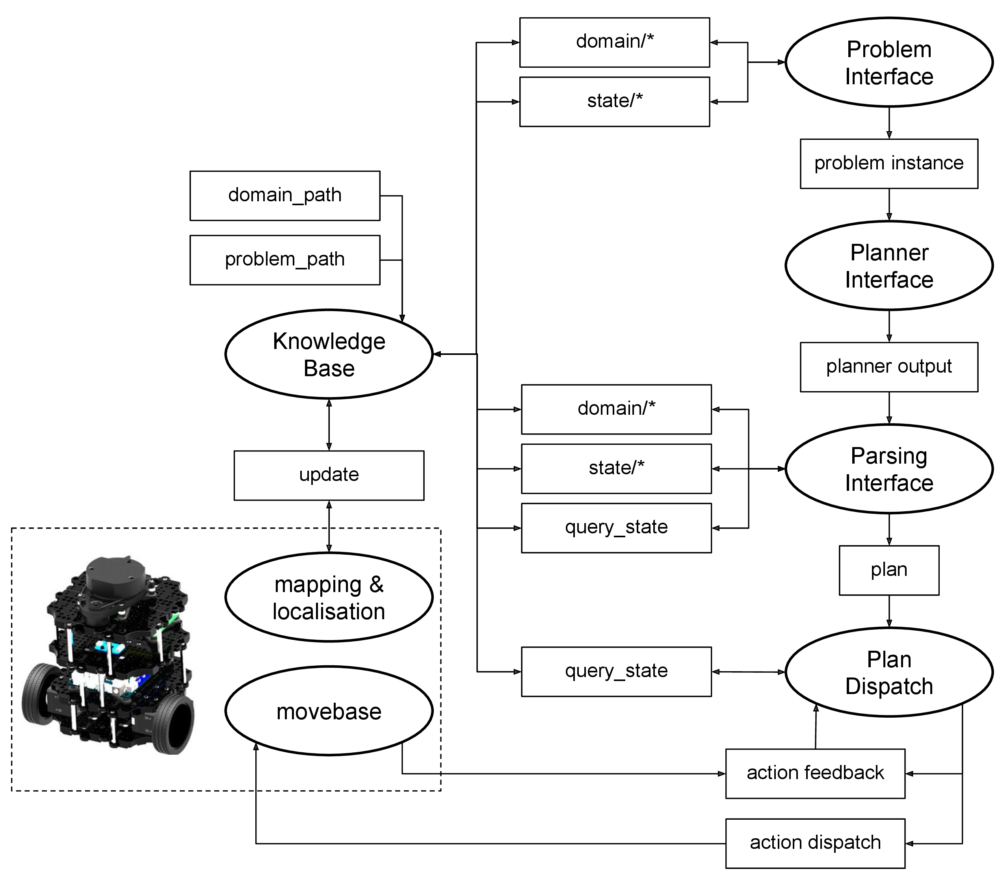

# What is ROSPlan?

The ROSPlan framework provides a generic method for task planning in a ROS system. ROSPlan has a variety of nodes which encapsulate planning, problem generation, and plan execution. It possesses a simple interface, and includes some basic interfaces to common ROS libraries.

{: .big_chart }

**What is it for?**

ROSPlan has a modular design, intended to be modified. It serves as a framework to test new modules with minimal effort. Alternate approaches to state estimation, plan representation, dispatch and execution can be tested without having to write an entire framework.

**Where to start?**

The [documentation](documentation) gives a full description of the system.
The [tutorials](tutorials) section provides a step-by-step introduction to each node, and instructions on combining them into a complete system.
